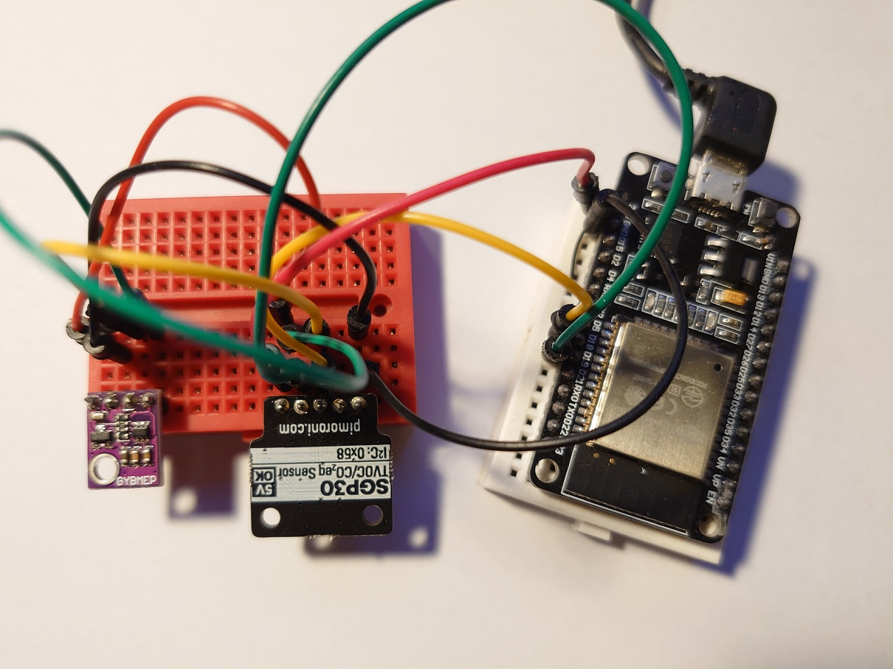
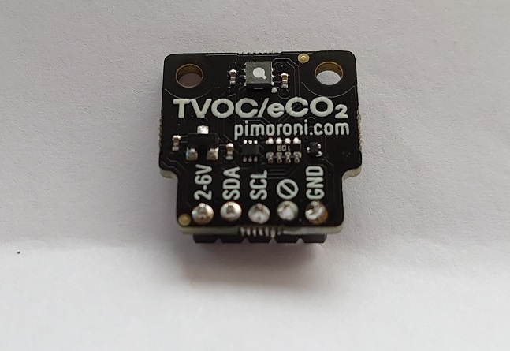
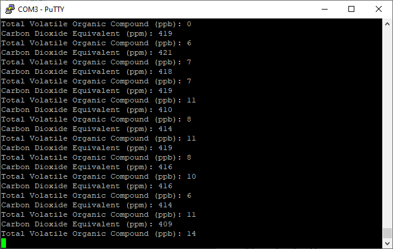
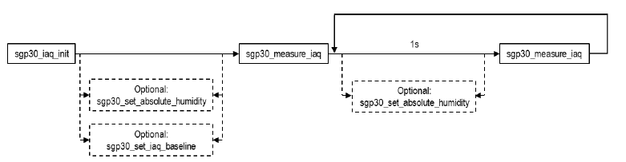
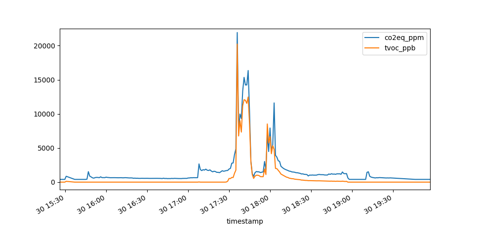

Introduction
============

This is a MicroPython fork of the `Adafruit CircuitPython SGP30 library <https://github.com/adafruit/Adafruit_CircuitPython_SGP30>`_. This library is designed to interface with a Sensirion SGP30 module / breakout board over I2C, and retrieve Equivalent Carbon Dioxide (CO2eq) and Total Volatile Organic Compounds (TVOC) readings.

This particular library has removed the original Adafruit library's dependency on the :code:`adafruit_bus_device.i2c_device` module, and supports MicroPython's native :code:`machine.I2C` implementation directly. It has also widened support for SGP30 commands not present in the original library, specifically for "measure test" and "humidity compensation" functionalities (and more).

Prerequisites
---------------

* So far, this library has been tested only with ESP32 MicroPython firmware (v1.11 and above). Various ESP-WROOM-32 DevKitC development boards have been used.
* (Optional) To perform humidity compensation, another sensor capable of taking temperature and relative humidity measurements is required (such as 1-Wire-based DHT11/22, I2C-based BMP280 devices or Sensirion's own SHT range).
* (Optional) To capture SGP30 baselines for persistence across sensor power-ups / soft resets, non-volatile memory is needed (for example, built-in flash, or external SD card or EEPROM).

Hardware
---------------

SGP30 has an I2C interface. For all remaining examples, the following pins of an ESP32 development are used.

================ ==========
SGP30 Pin        ESP32 Pin
================ ==========
I2C Data (SDA)   GPIO 18
I2C Clock (SCL)  GPIO 19
================ ==========

Depending on the SGP30 breakout board you have, options for power supply (and maximum input voltages tolerated) will vary.

Installation
---------------

Simply upload the :code:`uSGP30.py` file to ESP32 MicroPython operating system and :code:`import` the module.

Optionally, upload the :code:`uSGP30_test.py` file to execute the test script. See `Testing`_ for more information.

Operation
============

Usage Notes
---------------
The :code:`SGP30` class can simply be instantiated using a valid MicroPython :code:`I2C` object which has been initialised with the corresponding I2C pins. The default behaviour of this library is to conduct a chip test (:code:`measure_test=True`), and to initialise the sensor algorithm (:code:`iaq_init=True`) - both can be disabled. Additional device information is outputted to the console post-initialisation.

Example - Instantiate I2C and uSGP30 Classes
~~~~~~~~~~~~~~~~~~~~~~~~~~~~~~~~~~~~~~~~~~~~~~~~~~

.. code-block:: python

	import uSGP30
	import machine

	I2C_SCL_GPIO = const(18)
	I2C_SDA_GPIO = const(19)
	I2C_FREQ = const(400000)
	i2c = machine.I2C(
	    scl=machine.Pin(I2C_SCL_GPIO, machine.Pin.OUT),
	    sda=machine.Pin(I2C_SDA_GPIO, machine.Pin.OUT),
	    freq=I2C_FREQ
	)
	sgp30 = uSGP30.SGP30(i2c)

Reading from the Sensor
------------------------

To simply read (and print) the CO2eq and TVOC values from the sensor (after the 15 second initialisation period during which only the default values of 400 and 0 are returned), use the :code:`measure_iaq()` method. This returns a 2-value tuple of CO2eq and TVOC measurements.

Example - Measure CO2eq and TVOC
~~~~~~~~~~~~~~~~~~~~~~~~~~~~~~~~~~~

.. code-block:: python

    co2eq_ppm, tvoc_ppb = sgp30.measure_iaq()
    print(co2eq_ppm, tvoc_ppb)

Measurements should be taken periodically, for example, in an indefinite :code:`while` loop equipped with suitable delays. A 1 second interval for the actual SGP30 measurements is recommended by the `Sensirion SGP30 Datasheet <docs/Sensirion_Gas_Sensors_SGP30_Datasheet.pdf>`_ to facilitate the sensor's operation of its internal dynamic baseline compensation algorithm. This *likely* means that ESP32 deepsleep - where the microcontroller is offline for extended durations - is not conducive to optimal operation of the SGP30 sensor.

Example - Measure CO2eq and TVOC Indefinitely
~~~~~~~~~~~~~~~~~~~~~~~~~~~~~~~~~~~~~~~~~~~~~~~~~~~~

.. code-block:: python

	import time

	while True:
	    co2eq_ppm, tvoc_ppb = sgp30.measure_iaq()
	    print(
	        "Carbon Dioxide Equivalent (ppm): " + str(co2eq_ppm) + "\n" +
	        "Total Volatile Organic Compound (ppb): " + str(tvoc_ppb)
	    )
	    time.sleep(1)

Optional Commands
==================

Humidity Compensation
------------------------

Optionally, the SGP30 allows its internal algorithm to be compensated *if* provided with actual absolute humidity. If you have a relative humidity (%) and temperature (°C) sensors, the :code:`convert_r_to_a_humidity()` function available in the :code:`uSGP30` module can be used to calcuate the absolute humidity. This value can then be applied to the sensor using the :code:`set_absolute_humidity()` method.

.. warning::
	Note that the exact 8.8 fixed point value (2 byte word) outputted by the :code:`convert_r_to_a_humidity()` function needs to be applied to the sensor. To see what the actual (readable) g/m^3 absolute humidity value is, use the :code:`fixed_point=False` flag when calling :code:``convert_r_to_a_humidity()` but **DO NOT** apply this value directly to the sensor.

The equation for the conversion is documented in the `Sensirion SGP30 Datasheet <docs/Sensirion_Gas_Sensors_SGP30_Datasheet.pdf>`_.

Humidity compensation is disabled by default after power-up / soft reset (until a value is explicitly set), and can be disabled again during operation by setting a value of 0.

Example - Humidity Compensation
~~~~~~~~~~~~~~~~~~~~~~~~~~~~~~~~

.. code-block:: python

	# Values from another sensor
	temp_c = 25
	r_humidity_perc = 50
	
	a_humidity_perc_readable = uSGP30.convert_r_to_a_humidity(temp_c, r_humidity_perc, fixed_point=False)
	print(a_humidity_perc_readable)
	a_humidity_perc = uSGP30.convert_r_to_a_humidity(temp_c, r_humidity_perc)
	sgp30.set_absolute_humidity(a_humidity_perc)

Humidity compenstation is optional. However, if applied, it should be set immediately after sensor initialisation, and in between each call of :code:`measure_iaq()` as explained in `Main Application`_.

Get and Set Baselines
------------------------

Current algorithm baselines calculated by the SGP30 sensor during the course of its operation can be read using the :code:`get_iaq_baseline()` method. In order for this baseline to persist after subsequent sensor power-ups or soft resets, the baseline values can be retrieved and stored in non-volatile memory, and set after the next power-up / soft reset using the :code:`set_iaq_baseline()` method. If not, a 12-hour early operation phase is required again for the sensor to re-establish its baseline. Only baselines *younger* than a week is valid.

The simplest way to achieve this for an offline ESP32 device, with no additional hardware, would be to simply store these values in a file on the built-in flash memory presented as a filesystem. Other alternatives involving additional hardware would be an EEPROM or a Micro SD card. Likewise, for connected ESP32 devices, the baseline *could* be stored elsewhere on the network, or in the cloud.

The `Sensirion SGP30 Driver Integration Guide <docs/Sensirion_Gas_Sensors_SGP30_Driver-Integration-Guide_SW_I2C.pdf>`_ suggests that baselines are stored after the first hour of operation, and continue to be stored hourly after that.

.. note::
	Baselines are only valid for 7 days. In other words, if the sensor has been powered off for over 7 days (or a baseline hasn't been retrieved during that timeframe), the 12-hour early operation phase would be required to recalibrate the sensor regardless of whether a baseline exists.

Example - Get and Set Baselines
~~~~~~~~~~~~~~~~~~~~~~~~~~~~~~~~~~~~

.. code-block:: python

	import ujson
	
	BASELINE_FILE = "sgp30_iaq_baseline.txt"
	
	# Before power down / soft reset...
	current_baseline = sgp30.get_iaq_baseline()
	with open(BASELINE_FILE, "w") as file:
	    file.write(str(current_baseline))
	
	# After power up / soft reset...
	with open(BASELINE_FILE, "r") as file:
	    current_baseline = ujson.loads(file.read())
	sgp30.set_iaq_baseline(current_baseline[0], current_baseline[1])

An additional check to see if the last baseline was stored in the last 7 days would require the ESP32 device to have the correct time (either via NTP or RTC), and that this timestamp is stored together with the baseline and checked before committing to the sensor after power-up / soft reset.

Additional Commands
------------------------

Other SGP30 commands are supported by this library through their respective methods.

=========================  ===============================================================================
Method                     Description
=========================  ===============================================================================
:code:`measure_test()`     Runs on-chip self test
:code:`get_feature_set()`  Retrieves feature set of sensor
:code:`measure_raw()`      Returns raw H2 and Ethanol signals, used for part verification and testing
:code:`get_serial()`       Retrieves sensor serial
=========================  ===============================================================================

Main Application
==================

Command Sequence
-------------------------------------

The overall command sequence of the SGP30 is described in the `Sensirion SGP30 Datasheet <docs/Sensirion_Gas_Sensors_SGP30_Datasheet.pdf>`_ (shown below). It is recommended that the application utilising this library calls the methods in the designated sequence, with the correct timings.

In the context of this sequence, the application flow would *probably* look like this.

1. Instantiate a built-in :code:`I2C` class using designated GPIO pins.
2. Instantiate uSGP30 library's :code:`SGP30` class using the :code:`I2C` object (this will initialise the SGP30 sensor). Wait 15 seconds for initialisation to complete.
3. If running for the first time or you do not have a valid baseline stored, operate the sensor in a "clean" environment (e.g. outdoors) for 12 hours for it to establish a reliable baseline. (Optional) If you have a baseline that was taken < 7 days ago, retrieve previous baseline from non-volatile memory and apply to the sensor using :code:`set_iaq_baseline()`.
4. (Optional) Set humidity compensation using :code:`set_absolute_humidity()`. Temperature and relative humidity data required to perform this must come from another sensor, and converted using :code:`convert_r_to_a_humidity()`.
5. Take CO2eq and TVOC measurements using :code:`measure_iaq()` and use these in the application.
6. (Optional) Commit current baseline to non-volatile memory hourly using :code:`get_iaq_baseline()`.
7. Repeat steps 4 and 5, at 1 second intervals.

Clearly, the embedded application is likely to perform other tasks during its run. Therefore, the above sequence should be accommodated by the code using synchronous or asynchronous MicroPython techniques. In particular, special attention should be paid to keeping to the 1 second timed measurements.

Testing
==========

Place the sensor in a "dirty" environment, for example above the cooking area in the kitchen, and you should be able to obtain some exciting readings!

For data to be available outside of the embedded device, use MQTT to publish the readings over the network or store them locally on a SD card.

Test Script
-------------------------------------

A test script :code:`uSGP30_test.py` is included in this library.

Example - Run uSGP30_test.py Test Script
~~~~~~~~~~~~~~~~~~~~~~~~~~~~~~~~~~~~~~~~~~~~~

.. code-block:: python

	import uSGP30_test
	uSGP30_test.run()

Note that the script currently:

* Uses test values (made-up) for temperature and humidity for triggering humidity compensation. For ways to include actual readings, see `Humidity Compensation`_.
* Does not check < 7 day validity of stored baseline. For possible ways to check this, see `Get and Set Baselines`_.
* Does not enforce 12 hour early operation phase if no baseline is found (just a warning is displayed). This could be achieved by enforcing a delay of 12 hours accompanying the warning before measurements start to be taken.

Used in Conjunction with Deepsleep
-------------------------------------

.. warning::
	Note the various calibration / initialisation parameters documented in the `Sensirion SGP30 Driver Integration Guide <docs/Sensirion_Gas_Sensors_SGP30_Driver-Integration-Guide_SW_I2C.pdf>`_. Specifically, there is a 15-second device initialisation period, and a recommended 12-hour early operation phase. Furthermore, for optimal establishment of the internal baseline, it is suggested that a measurement is taken every second. As such, it is not believed that a microprocessor will be able to meet these criteria with extended durations of deepsleep in between readings.

For experimental testing purposes, the :code:`SGP30` class can be instantiated with the :code:`iaq_init=False` flag set. This will not instruct the SGP30 sensor to initialise its baselines (for example, if the sensor itself has remained powered throughout, even if the microprocessor has not).

This *could* be used in conjunction with a test to see if the ESP32 has been awakened from deepsleep to bypass the sensor calibration and rely solely on existing baselines... although this is so far untested and likely to be not recommended due to earlier points.

Example - *Potential* Deepsleep Application
~~~~~~~~~~~~~~~~~~~~~~~~~~~~~~~~~~~~~~~~~~~~~~~~~~~~

.. code-block:: python
	
	if machine.reset_cause() == machine.DEEPSLEEP_RESET:
	    initialise_sgp30_algo = False
	else:
	    initialise_sgp30_algo = True
	sgp30 = uSGP30.SGP30(i2c, iaq_init=initialise_sgp30_algo)

Blog Post(s)
=========================

The usage of this sensor and module is described in the following `Rosie the Red Robot <https://www.rosietheredrobot.com>`_ blog post:

* `Unreal TV <https://www.rosietheredrobot.com/2020/04/unreal-tv.html>`_

Further Documentation
=========================

* `Sensirion SGP30 Datasheet <docs/Sensirion_Gas_Sensors_SGP30_Datasheet.pdf>`_
* `Sensirion SGP30 Driver Integration Guide <docs/Sensirion_Gas_Sensors_SGP30_Driver-Integration-Guide_SW_I2C.pdf>`_
* `Adafruit SGP30 Guide <docs/adafruit-sgp30-gas-tvoc-eco2-mox-sensor.pdf>`_