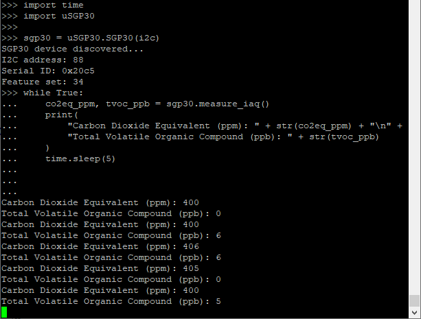

Introduction
============

This is a MicroPython fork of the Adafruit CircuitPython SGP30 library (https://github.com/adafruit/Adafruit_CircuitPython_SGP30). The library is designed to interface with a SGP30 module / breakout board over I2C, and retrieve Total Volatile Organic Compounds (TVOC) and Equivalent Carbon Dioxide (CO2eq) readings.

This driver has removed the original Adafruit library's dependency on the adafruit_bus_device.i2c_device module, and supports MicroPython's native i2c implementation directly. It has also widened support for SGP30 commands not present in the original library.

So far, it has been tested only with ESP32 MicroPython firmware.

.. image:: docs/pimoroni_sgp30.JPG

Usage Notes
=============

The SGP30 class can simply be instantiated using a valid I2C object with the corresponding hardware pins. The default behaviour is to conduct a chip test (:code:`measure_test=True`), and to initialise the sensor algorithm (:code:`iaq_init=True`). There may be use cases where these may not be the desired behaviour.

.. code-block:: python

	import uSGP30

	I2C_SCL_GPIO = const(18)
	I2C_SDA_GPIO = const(19)
	I2C_FREQ = const(400000)
	i2c = machine.I2C(
	    scl=machine.Pin(I2C_SCL_GPIO, machine.Pin.OUT),
	    sda=machine.Pin(I2C_SDA_GPIO, machine.Pin.OUT),
	    freq=I2C_FREQ
	)
	sgp30 = uSGP30.SGP30(i2c)

Reading from the Sensor
------------------------

To simply read (and print) the CO2eq and TVOC values from the sensor (after the 15 second initialisation period), use the :code:`measure_iaq()` method:

.. code-block:: python

    co2eq_ppm, tvoc_ppb = sgp30.measure_iaq()
    print(co2eq_ppm, tvoc_ppb)

Measurements should be taken periodically, for example, in a loop. 1 second interval is recommended in the datasheet for proper operation of the dynamic baseline compensation algorithm:

.. code-block:: python

	import time

	while True:
	    co2eq_ppm, tvoc_ppb = sgp30.measure_iaq()
	    print(
	        "Carbon Dioxide Equivalent (ppm): " + str(co2eq_ppm) + "\n" +
	        "Total Volatile Organic Compound (ppb): " + str(tvoc_ppb)
	    )
	    time.sleep(1)

Humidity Compensation
------------------------

Optionally, the SGP30 allows its algorithm to be compensated for actual absolute humidity. If you have a relative humidity (%) and temperature (°C) sensors, the :code:`convert_r_to_a_humidity()` function available in the module can be used to calcuate the absolute humidity. The value can then be applied to the sensor using the :code:`set_absolute_humidity()` method. Note that the exact 8.8 fixed point value from the :code:`convert_r_to_a_humidity()` function needs to be applied to the sensor. To see what the actual g/m^3 absolute humidity value is, use the :code:`fixed_point=False` flag when calling `convert_r_to_a_humidity()` but DO NOT apply this to the sensor.

.. code-block:: python

	temp_c = 25
	r_humidity_perc = 50
	
	a_humidity_perc = uSGP30.convert_r_to_a_humidity(temp_c, r_humidity_perc)
	sgp30.set_absolute_humidity(a_humidity_perc)

Humidity compenstation is optional. However, if applied, it could be set after sensor initialisation, and in between :code:`measure_iaq()`.

Get and Set Baselines
------------------------

Baselines calculated by the SGP30 sensor during the course of its operation can be read using the :code:`get_iaq_baseline()` method. In order for this baseline to persist after subsequent sensor power-ups or soft resets, the baseline values can be retrieved and stored in non-volatile memorty, and set after the next power-up / soft reset using the :code:`set_iaq_baseline()` method. Otherwise a 12-hour early operation phase is required again for the sensor to re-establish its baseline.

.. code-block:: python

	BASELINE_FILE = "sgp30_iaq_baseline.txt"
	
	current_baseline = uSGP30.get_iaq_baseline()
	with open(BASELINE_FILE, "w") as file:
	    file.write(current_baseline)
	
	# After power up / soft reset...
	with open(BASELINE_FILE, "r") as file:
	    current_baseline = file.read()
	uSGP30.set_iaq_baseline(current_baseline)

Testing
==========

Place the sensor for example above the cooking area in the kitchen, and you should be able to obtain some exciting readings.

.. image:: docs/4g_matplotlit_ppm_ppb.png

Used in Conjunction with Deepsleep
------------------------

Note the various calibration / initialisation parameters documented in the Sensirion SGP30 Driver Integration Guide. Specifically, there is a 15-second device initialisation period, and a recommended 12-hour early operation phase. In order to prevent the reinitialisation of the SGP30 algorithm / baseline after each microprocessor deepsleep, instantiate the uSGP30 class with the :code:`iaq_init` set to :code:`False`. If initialising the sensor, cater for the 15 second initialisation period.

.. code-block:: python

	import machine

    SGP30_INIT_MS = const(15000)
    if machine.reset_cause() == machine.DEEPSLEEP_RESET:
        initialise_sgp30_algo = False
    else:
        initialise_sgp30_algo = True
    sgp30 = uSGP30.SGP30(i2c, iaq_init=initialise_sgp30_algo)
    if initialise_sgp30_algo:
        sleep_ms(SGP30_INIT_MS)

Blog Post
=========================

The usage of this sensor and module is described in the following `Rosie the Red Robot <https://www.rosietheredrobot.com>` blog post:

* `Unreal TV <https://www.rosietheredrobot.com/2020/04/unreal-tv.html>`_

Documentation
=========================

* `Sensirion SGP30 Datasheet <docs/Sensirion_Gas_Sensors_SGP30_Datasheet.pdf>`_
* `Sensirion SGP30 Driver Integration Guide <docs/Sensirion_Gas_Sensors_SGP30_Driver-Integration-Guide_SW_I2C.pdf>`_
* `Sensirion SGP30 Driver Integration Guide <docs/adafruit-sgp30-gas-tvoc-eco2-mox-sensor.pdf>`_